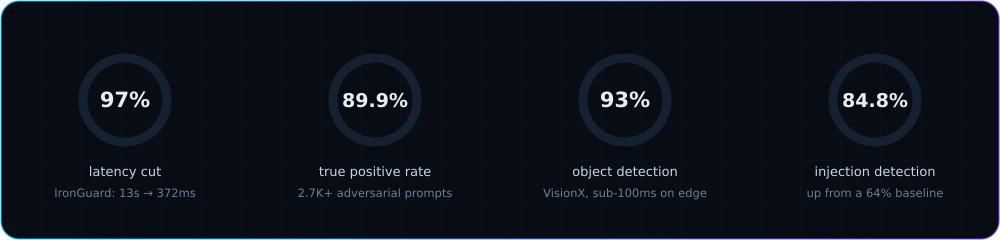

<!--
  piyush-karn / README.md
  Custom animated SVGs live in ./assets  (hero.svg, terminal.svg, metrics.svg)
  Repo links marked TODO below — swap in your exact repo URLs.
-->

<div align="center">



<br/>

<a href="https://aiwithpiyush.netlify.app/">
  
</a>

<br/>

<a href="https://aiwithpiyush.netlify.app/"></a>
<a href="https://linkedin.com/in/piyushkumar-ai"></a>
<a href="mailto:piyushkarn96@gmail.com"></a>
<a href="https://twitter.com/piyushkarn34316"></a>
<a href="https://huggingface.co/spaces/piyushkarn/visionx"></a>


</div>

<br/>

<div align="center">
  
</div>

<br/>

## Where I spend my time

I'm a B.Tech CS student in Noida who ships AI systems end to end — model, pipeline, API, and the interface on top of it. Two threads run through most of my work: **making language models safe to put in front of users**, and **making vision models fast enough to run where the data is**.

- Currently building **IronGuard**, a security gateway that sits in front of LLM apps and catches prompt injection, jailbreaks, and PII leaks in real time
- Deepening **agentic AI workflows**, retrieval pipelines, and inference optimization
- Happy to talk about **LLM red-teaming, YOLOv8 on edge hardware, FastAPI services**, or a good hackathon idea
- Reach me at **piyushkarn96@gmail.com**

<br/>

## Results from shipped systems

<div align="center">
  
</div>

<br/>

## Featured builds

<table>
<tr>
<td width="50%" valign="top">

### IronGuard
**AI security gateway for LLM applications**

A multi-layer gateway that inspects every prompt before it reaches your model — prompt injection, jailbreak attempts, and PII leakage, scored in real time.

- Detection accuracy `64% → 84.8%` (+21 pts)
- True positive rate `60% → 89.9%` across 2,700+ adversarial prompts
- Latency `13,000ms → 372ms` (~97% faster)
- Hybrid rule-based + semantic scoring engine

`Python` `FastAPI` `NLP` `Vector DB`

<!-- TODO: replace with the exact repo URL -->
<a href="https://github.com/piyush-karn"></a>

</td>
<td width="50%" valign="top">

### VisionX &nbsp;🏆
**Real-time critical object detection**

Hazard detection for space-station safety scenarios, built to run on constrained edge compute during a national hackathon — and it won.

- 93% detection accuracy on the target object set
- Sub-100ms inference after TensorRT optimization
- 1st place, Hackwave 2025, sponsored by Duality AI

`YOLOv8` `OpenCV` `TensorRT` `Flask`

<a href="https://piyushkarn-visionx.hf.space/"></a>
<a href="https://github.com/piyush-karn"></a>

</td>
</tr>
<tr>
<td width="50%" valign="top">

### ResumeSnap
**Resume analyzer and job matcher**

Turns unformatted resume text into structured data with a Gemini-backed prompting pipeline, then ranks candidates against job descriptions.

- Cosine-similarity matching across a 5K+ dataset
- ~15 minutes of manual review down to under 10 seconds per resume
- OCR + NLP recommender for candidate-role alignment

`Python` `Gemini API` `Scikit-learn` `Streamlit`

<a href="https://piyushkarn-resumesnap.hf.space/"></a>
<a href="https://github.com/piyush-karn"></a>

</td>
<td width="50%" valign="top">

### Portfolio
**Two front doors**

The main portfolio covers the AI work end to end; the second one is a pure frontend playground where I test motion and layout ideas before they land anywhere serious.

- aiwithpiyush.netlify.app — AI/ML work
- ninjaflames26.netlify.app — frontend experiments

`React` `Tailwind` `Motion`

<a href="https://aiwithpiyush.netlify.app/"></a>
<a href="https://ninjaflames26.netlify.app/"></a>

</td>
</tr>
</table>

<br/>

## Toolkit

<div align="center">


</div>

<div align="center">


</div>

<br/>

## The path so far

```text
2026 ──▶  Software Intern @ AventIQ (Mittal Software Labs) — Delhi
2026 ──▶  Frontend Developer Intern @ The Angaar Batch — edtech platform, live traffic
2025 ──▶  Software Engineering Intern @ Wandrai Dashboard (Verso) — sole frontend dev,
          led the Expo → React + Vite migration
2025 ──▶  1st place, Hackwave 2025 National AI Hackathon (Duality AI)
2023 ──▶  B.Tech Computer Science, KCC Institute of Technology & Management
```

<br/>

## Wins and certifications

<div align="center">

| | |
|---|---|
| 🥇 **Hackwave 2025 — 1st place** | National AI hackathon, Duality Track, sponsored by Duality AI |
| 🧠 **GenAI Buildathon** | Generative AI Mastery Workshop, OpenAI Academy Learning Community × NxtWave |
| 🛒 **Flipkart GRiD 6.0** | Software Development Track, Level 1 qualifier |
| ⚡ **HackIndia Spark 4** | East NCR Growth Region |

</div>

<br/>

## GitHub signal

<div align="center">


</div>

<br/>

<div align="center">

<picture>
  <source media="(prefers-color-scheme: dark)" srcset="https://raw.githubusercontent.com/piyush-karn/piyush-karn/output/snake-dark.svg" />
  <source media="(prefers-color-scheme: light)" srcset="https://raw.githubusercontent.com/piyush-karn/piyush-karn/output/snake.svg" />
  
</picture>

</div>

<br/>

<div align="center">

### Working on something in AI security or real-time vision? Let's build it.

<a href="mailto:piyushkarn96@gmail.com"></a>
<a href="https://linkedin.com/in/piyushkumar-ai"></a>


</div>
